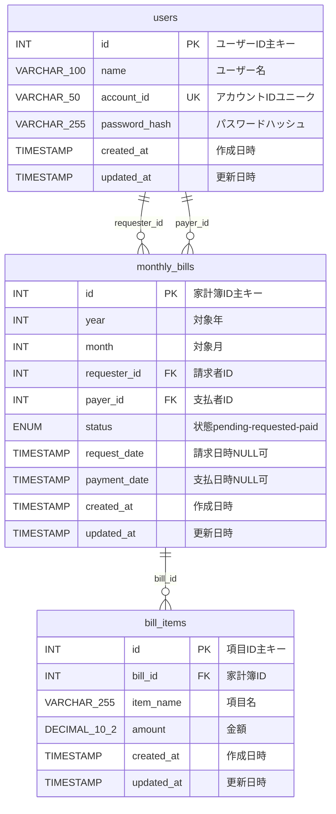
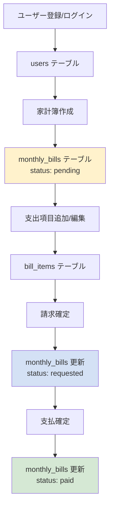

# データモデル設計書（セキュリティ強化版）

## 1. 概要

家計簿アプリケーションのデータベース設計とデータモデルの詳細仕様書です。MySQL 8.0を使用し、UTF-8エンコーディング（utf8mb4）で多言語対応を行っています。

**セキュリティレベル**: Phase 3 完了済み（本番環境対応）
- Docker Secrets によるパスワード保護
- SQLインジェクション対策（ORM + 入力値検証）
- セキュアな接続管理

## 2. ER図（Entity Relationship Diagram）



## 3. テーブル定義

### 3.1 users（ユーザーテーブル）

ユーザーアカウント情報を管理するテーブルです。

| カラム名 | データ型 | 制約 | 説明 |
|----------|----------|------|------|
| id | INT | PRIMARY KEY, AUTO_INCREMENT | ユーザーの一意識別子 |
| name | VARCHAR(100) | NOT NULL | ユーザー表示名 |
| account_id | VARCHAR(50) | UNIQUE, NOT NULL | ログイン用アカウントID |
| password_hash | VARCHAR(255) | NOT NULL | bcryptでハッシュ化されたパスワード |
| created_at | TIMESTAMP | DEFAULT CURRENT_TIMESTAMP | レコード作成日時 |
| updated_at | TIMESTAMP | DEFAULT CURRENT_TIMESTAMP ON UPDATE | レコード更新日時 |

**制約・インデックス:**
- PRIMARY KEY: `id`
- UNIQUE KEY: `account_id`
- CHARACTER SET: utf8mb4 COLLATE utf8mb4_unicode_ci

**初期データ:**
初期ユーザーデータは投入されません。アプリケーション起動後、Web UI から新規ユーザー登録を行ってください。

### 3.2 monthly_bills（月次家計簿テーブル）

月ごとの家計簿管理の中心となるテーブルです。

| カラム名 | データ型 | 制約 | 説明 |
|----------|----------|------|------|
| id | INT | PRIMARY KEY, AUTO_INCREMENT | 家計簿の一意識別子 |
| year | INT | NOT NULL | 対象年（YYYY形式）|
| month | INT | NOT NULL | 対象月（1-12）|
| requester_id | INT | NOT NULL, FOREIGN KEY | 請求者のユーザーID |
| payer_id | INT | NOT NULL, FOREIGN KEY | 支払者のユーザーID |
| status | ENUM | DEFAULT 'pending' | 家計簿の状態 |
| request_date | TIMESTAMP | NULL | 請求確定日時 |
| payment_date | TIMESTAMP | NULL | 支払確定日時 |
| created_at | TIMESTAMP | DEFAULT CURRENT_TIMESTAMP | レコード作成日時 |
| updated_at | TIMESTAMP | DEFAULT CURRENT_TIMESTAMP ON UPDATE | レコード更新日時 |

**制約・インデックス:**
- PRIMARY KEY: `id`
- FOREIGN KEY: `requester_id` REFERENCES `users(id)`
- FOREIGN KEY: `payer_id` REFERENCES `users(id)`
- UNIQUE KEY: `unique_month_requester (year, month, requester_id)`
- CHARACTER SET: utf8mb4 COLLATE utf8mb4_unicode_ci

**statusカラムの値:**
- `pending`: 作成中（項目編集可能）
- `requested`: 請求済み（請求者が確定、支払者の確認待ち）
- `paid`: 支払済み（完了状態）

### 3.3 bill_items（家計簿項目テーブル）

家計簿内の個別の支出項目を管理するテーブルです。

| カラム名 | データ型 | 制約 | 説明 |
|----------|----------|------|------|
| id | INT | PRIMARY KEY, AUTO_INCREMENT | 項目の一意識別子 |
| bill_id | INT | NOT NULL, FOREIGN KEY | 所属する家計簿のID |
| item_name | VARCHAR(255) | NOT NULL | 支出項目名（例：食費、交通費）|
| amount | DECIMAL(10,2) | NOT NULL | 金額（小数点以下2桁まで）|
| created_at | TIMESTAMP | DEFAULT CURRENT_TIMESTAMP | レコード作成日時 |
| updated_at | TIMESTAMP | DEFAULT CURRENT_TIMESTAMP ON UPDATE | レコード更新日時 |

**制約・インデックス:**
- PRIMARY KEY: `id`
- FOREIGN KEY: `bill_id` REFERENCES `monthly_bills(id)` ON DELETE CASCADE
- CHARACTER SET: utf8mb4 COLLATE utf8mb4_unicode_ci

## 4. リレーションシップ

### 4.1 Users ← MonthlyBills（1対多）

**requester_id関連:**
- 1人のユーザーは複数の家計簿の請求者になれる
- 1つの家計簿には1人の請求者のみ
- 請求者は項目の編集・請求確定権限を持つ

**payer_id関連:**
- 1人のユーザーは複数の家計簿の支払者になれる
- 1つの家計簿には1人の支払者のみ
- 支払者は閲覧・支払確定権限を持つ

### 4.2 MonthlyBills ← BillItems（1対多）

- 1つの家計簿は複数の支出項目を持てる
- 1つの項目は1つの家計簿にのみ属する
- CASCADE削除により、家計簿削除時に関連項目も削除される

## 5. Go言語でのモデル定義

### 5.1 User（ユーザーモデル）

```go
type User struct {
    ID           uint      `json:"id" gorm:"primaryKey"`
    Name         string    `json:"name"`
    AccountID    string    `json:"account_id" gorm:"unique"`
    PasswordHash string    `json:"-"`  // JSONレスポンスから除外
    CreatedAt    time.Time `json:"created_at"`
    UpdatedAt    time.Time `json:"updated_at"`
}
```

### 5.2 MonthlyBill（月次家計簿モデル）

```go
type MonthlyBill struct {
    ID          uint        `json:"id" gorm:"primaryKey"`
    Year        int         `json:"year"`
    Month       int         `json:"month"`
    RequesterID uint        `json:"requester_id"`
    PayerID     uint        `json:"payer_id"`
    Status      string      `json:"status" gorm:"type:enum('pending','requested','paid');default:'pending'"`
    RequestDate *time.Time  `json:"request_date"`
    PaymentDate *time.Time  `json:"payment_date"`
    Requester   User        `json:"requester" gorm:"foreignKey:RequesterID"`
    Payer       User        `json:"payer" gorm:"foreignKey:PayerID"`
    Items       []BillItem  `json:"items" gorm:"foreignKey:BillID"`
    CreatedAt   time.Time   `json:"created_at"`
    UpdatedAt   time.Time   `json:"updated_at"`
}
```

### 5.3 BillItem（家計簿項目モデル）

```go
type BillItem struct {
    ID        uint      `json:"id" gorm:"primaryKey"`
    BillID    uint      `json:"bill_id"`
    ItemName  string    `json:"item_name"`
    Amount    float64   `json:"amount" gorm:"type:decimal(10,2)"`
    CreatedAt time.Time `json:"created_at"`
    UpdatedAt time.Time `json:"updated_at"`
}
```

### 5.4 BillResponse（レスポンス用モデル）

```go
type BillResponse struct {
    MonthlyBill              // MonthlyBillを埋め込み
    TotalAmount float64 `json:"total_amount"`  // 計算済み総額（請求金額）
}
```

## 6. TypeScript型定義（フロントエンド）

```typescript
export interface User {
  id: number;
  name: string;
  account_id: string;
  created_at: string;
  updated_at: string;
}

export interface BillItem {
  id: number;
  bill_id: number;
  item_name: string;
  amount: number;
  created_at: string;
  updated_at: string;
}

export interface MonthlyBill {
  id: number;
  year: number;
  month: number;
  requester_id: number;
  payer_id: number;
  status: 'pending' | 'requested' | 'paid';
  request_date?: string;
  payment_date?: string;
  requester: User;
  payer: User;
  items: BillItem[];
  created_at: string;
  updated_at: string;
}

export interface BillResponse extends MonthlyBill {
  total_amount: number;
}
```

## 7. データフロー図



## 8. ビジネスルール

### 8.1 データ整合性ルール

1. **ユーザー関連:**
   - アカウントIDは重複不可（ログイン認証に使用）
   - アカウントIDは3-20文字、英数字とアンダースコアのみ許可
   - 削除されたユーザーに紐づく家計簿は孤立化防止のため削除制限

2. **家計簿関連:**
   - 同一請求者は同一年月に複数の家計簿を作成不可
   - 請求者と支払者は異なるユーザーである必要がある
   - `status`の状態遷移: pending → requested → paid のみ許可

3. **項目関連:**
   - 金額は正の数値のみ許可
   - `status`がpending以外の家計簿の項目編集は不可

### 8.2 権限ルール

- **請求者権限**: 項目追加/編集/削除、請求確定
- **支払者権限**: 閲覧、支払確定
- **共通権限**: 家計簿一覧表示、詳細閲覧

## 9. インデックス戦略

### 9.1 主要クエリパターン

1. **家計簿一覧取得:**
   ```sql
   SELECT * FROM monthly_bills
   WHERE requester_id = ? OR payer_id = ?
   ORDER BY year DESC, month DESC
   ```

2. **特定年月家計簿取得:**
   ```sql
   SELECT * FROM monthly_bills
   WHERE year = ? AND month = ? AND (requester_id = ? OR payer_id = ?)
   ```

### 9.2 推奨インデックス

```sql
-- 家計簿検索用複合インデックス
CREATE INDEX idx_bills_user_date ON monthly_bills (requester_id, year, month);
CREATE INDEX idx_bills_payer_date ON monthly_bills (payer_id, year, month);

-- 項目検索用インデックス
CREATE INDEX idx_items_bill ON bill_items (bill_id);
```

## 10. データ移行・バックアップ戦略

### 10.1 マイグレーション

GORMのAuto Migrationを使用してスキーマの自動更新を行います。

```go
func AutoMigrate(db *gorm.DB) error {
    return db.AutoMigrate(
        &models.User{},
        &models.MonthlyBill{},
        &models.BillItem{},
    )
}
```

### 10.2 バックアップ戦略

1. **日次フルバックアップ:** 全テーブルのデータをダンプ
2. **差分バックアップ:** binlogによる増分バックアップ
3. **レプリケーション:** リードレプリカによる高可用性確保

## 11. パフォーマンス考慮事項

### 11.1 N+1問題の回避

GORMのPreloadを使用して関連データを事前取得:

```go
db.Preload("Requester").Preload("Payer").Preload("Items").Find(&bills)
```

### 11.2 ページネーション

大量データ対応のためのOFFSET/LIMIT実装:

```go
db.Limit(pageSize).Offset(pageSize * (page - 1)).Find(&bills)
```

## 12. セキュリティ考慮事項（Phase 3 実装済み）

### 12.1 データベースセキュリティ

**Docker Secrets対応:**
- データベースパスワードはDocker Secretsで管理
- 環境変数への機密情報直接記載を回避
- 本番環境では外部シークレット管理システム推奨

**接続セキュリティ:**
```go
// セキュアなDB接続設定例
dsn := fmt.Sprintf("%s:%s@tcp(%s:%s)/%s?charset=utf8mb4&parseTime=True&loc=Local",
    dbUser,
    getDBPasswordSecure(), // Docker Secrets対応
    dbHost,
    dbPort,
    dbName,
)
```

### 12.2 SQLインジェクション対策

**GORM使用による安全なクエリ:**
```go
// ✅ セキュア - GORM使用
db.Where("year = ? AND month = ?", year, month).First(&bill)

// ❌ 危険 - 生SQL使用禁止
// db.Raw("SELECT * FROM monthly_bills WHERE year = " + year)
```

**入力値検証強化:**
- バックエンドで全入力値をサニタイゼーション
- 正規表現による型チェック
- XSS防止のためのHTMLエスケープ

### 12.3 データ保護

**パスワードハッシュ化:**
```go
// bcryptによるセキュアなハッシュ化
hash, _ := bcrypt.GenerateFromPassword([]byte(password), bcrypt.DefaultCost)
```

**機密データログ出力防止:**
```go
type User struct {
    PasswordHash string `json:"-"` // JSON出力から除外
}
```

### 12.4 監査・トレーサビリティ

**アクセスログ記録:**
- 全データベース操作をログ記録
- セキュリティ監査対応
- 異常アクセス検知機能

**データ整合性チェック:**
- 外部キー制約による参照整合性
- CHECK制約による値範囲制限
- トランザクション分離レベル最適化
